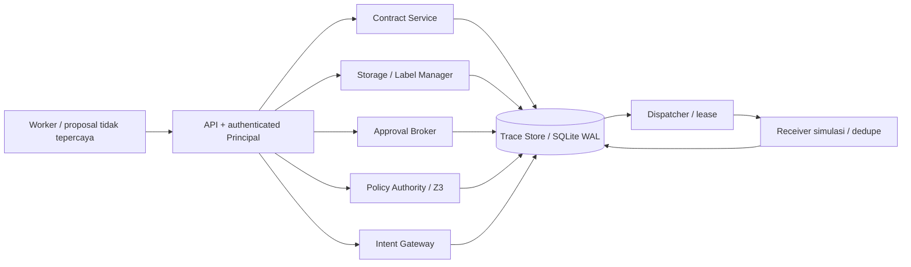
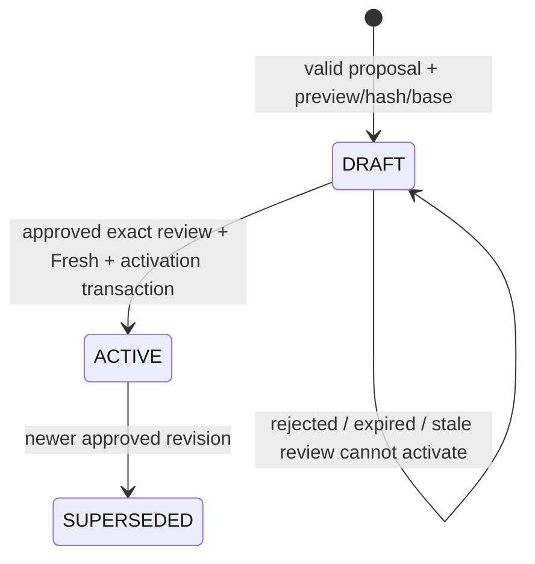
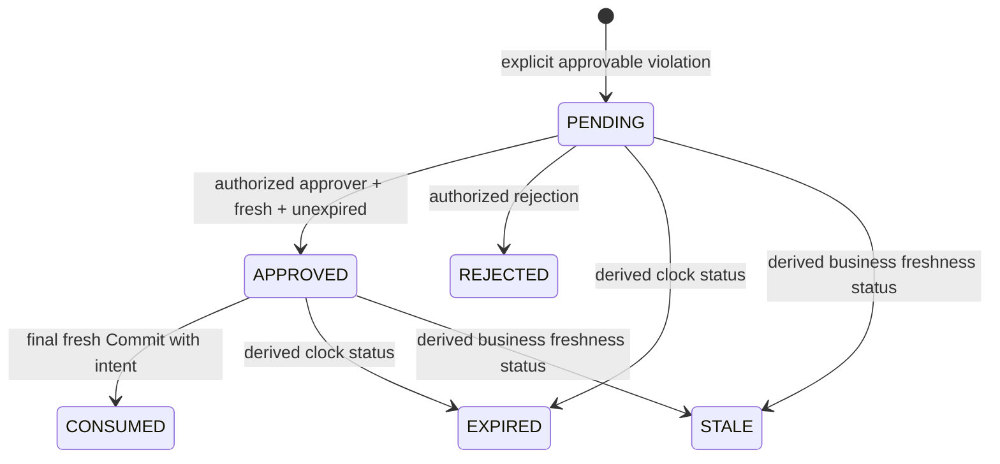
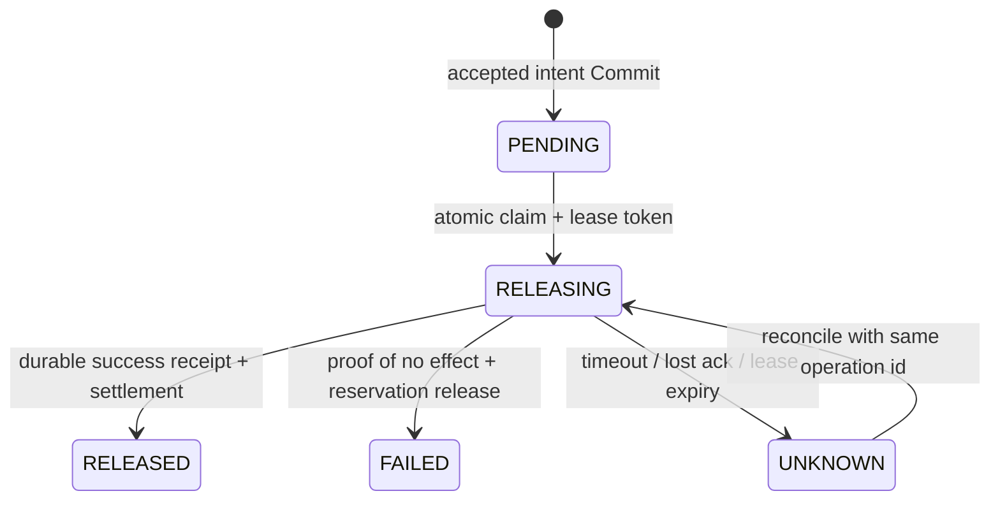

# AtomicRoot Fase 3 — framework foundation

Catatan ini merekam hasil Fase 3 awal. Audit/patch kompatibilitas kondisional
5 Oktober 2026 berada di [PHASE3_COMPAT_AUDIT.md](PHASE3_COMPAT_AUDIT.md),
termasuk proposal klasifikasi, restriction, scope inference simulasi dan hasil
regression terbaru. Bagian historis di bawah tidak mengklaim integrasi live.

## Status dan cara menjalankan

Prasyarat aktual: **84 test Fase 2 lulus** sebelum perubahan. Fase 3 memperluas
Trace Store, AST, StatusReader, format tiket Ed25519, canonical serialization,
dan harness yang sama. Implementasi baru berada di `atomicroot/framework/`.
Python melakukan validasi/kompilasi/orchestration/transaksi; keputusan constraint
tetap melalui Z3 tanpa evaluator native cadangan.

```powershell
.\.venv\Scripts\python.exe -m pytest atomicroot/tests -q
.\.venv\Scripts\python.exe phase3_cli.py demo
.\.venv\Scripts\python.exe phase3_cli.py schema
```

Demo memakai database sementara, fixture identitas terpisah, dan approval
eksplisit yang dicetak ke terminal. Alurnya: read PUBLIC, sharing, transfer
Rp200.000, lost acknowledgement, retry, read UNKNOWN, dan consent selektif.
Tidak ada koneksi ke receiver eksternal.

## Komponen dan batas akses



Worker hanya menerima API/client, bukan `FrameworkRuntime`, koneksi database,
SigningKey, `set_state`, atau fungsi settlement. Fungsi level rendah adalah API
host tepercaya, bukan sandbox Python. API memisahkan role worker, approver,
owner, dispatcher; task/resource scope berasal dari Principal milik resolver
autentikasi host. Role dalam body ditolak. Tidak ada SSO/autentikasi produksi,
dan kode worker tidak dieksekusi dalam proses service.

Gunakan `FrameworkRuntime(path, signing_key=..., clock=...)` dan
`create_phase3_app(runtime, identity_resolver)`. Resolver mengembalikan Principal
dari konteks host; test memakai mapping token fixture di luar body. Simpan
SigningKey yang sama jika tiket harus bertahan melintasi restart; key default
baru membatalkan tiket lama secara fail closed. Intent/receipt tetap durable.

SQLite WAL memiliki satu writer pada satu waktu. Test concurrency memakai
koneksi terpisah. Z3 default context diserialkan dengan lock proses; tidak ada
klaim eksekusi solver paralel.

## Grammar DSL

Policy JSON: `policy_id/version` immutable; `scope=task`; `applies_to` tool
resmi; `when/constraint` typed AST; `on_violation=DENY|ESCALATE`. Aturan dikompilasi
menjadi `If(when, constraint, True)`. Built-in scope, budget_monotone,
no_exfil_after_sensitive, dan unknown_release tidak dapat diganti oleh proposal.
Custom rule adalah tambahan; semua rule relevan memakai snapshot yang sama.

Rule yang sudah disahkan dapat dipakai ulang dengan `{policy_id, version}`.
Mengubah isi versi lama ditolak; revisi baru melalui diff kontrak dan approval.

| JSON op | Field tambahan | Tipe / makna |
|---|---|---|
| const | value | boolean, bounded integer/string |
| set | values | finite set string |
| request | name | tool, agent_id, purpose, recipient, resource tervalidasi |
| amount | — | amount konkret; tool tanpa pengeluaran memiliki nilai resmi 0 |
| ref | fact, scope | descriptor registry dan scope konkret |
| add, sub | left, right | arithmetic linear integer |
| eq | left, right | operand bertipe sama |
| le, lt | left, right | order integer |
| member, subset | left, right | membership / finite set subset |
| not | child | boolean |
| and, or | children | boolean |
| if | condition, yes, no | boolean condition, branch bertipe sama |

AST yang sama dipakai untuk type checking, traversal, encoding, dan data rule
pada preview. Static pass mengunjungi seluruh cabang; dynamic reads melalui
StatusReader digabung ke Footprint. Semua versi/nilai/provenance memakai satu
snapshot SQLite. Ref berbeda pada satu row kontrak memiliki simbol solver
berbeda tetapi Conflict key yang sama.

Batas: 256 node/depth 32 per ekspresi, delapan custom rule, 64 anggota/set,
256 karakter/item, request canonical 64 KiB, row fakta 16 KiB, konten storage
8 KiB, timeout solver 1.000 ms per check dan resource limit 100.000. Uang integer
0..2^63-1; satu unit contoh = satu IDR. Kontrak diperiksa terhadap batas row
sebelum aktivasi. Schema JSON tetap memerlukan validasi semantik service.

Facts harus konkret dan konsisten. Query `facts AND NOT(safe)`: SAT → DENY
dengan witness; UNSAT → ALLOW tanpa model. UNKNOWN, timeout, missing fact,
exception → EVALUATION_ERROR tanpa tiket/approval. Hard DENY menang atas
ESCALATE. Consent hanya menyelesaikan pelanggaran rule approvable eksplisit.
Tidak ada eval, worker SQL, arbitrary Z3 script, kuantor umum, nonlinear
multiplication, atau LTL checker.

## Source/update matrix

Registry immutable ada di `registry.py`; nilai/versi di SQLite. Sumber baru
memerlukan kode host tepercaya. Tidak ada endpoint generic set_fact atau
approval umum untuk mengedit counter.

| Fakta / konfigurasi | Conflict key | Sumber/updater sah | Operasi / approval |
|---|---|---|---|
| budget_limit, allowed_tools/resources/recipients/agents, purpose, unknown_release | contract3:<task> | Contract Service | exact approved proposal/base/preview |
| policy set membership | policyset:<task> | Contract Service | aktivasi revisi, selalu bump |
| policy definition | policy:<id>.<version> | Contract Service | insert immutable; perubahan perlu versi baru |
| budget_used | budget:<task> | initializer; Dispatcher | settlement, tanpa approval tiap increment |
| budget_reserved | reserved:<task> | initializer; Gateway/Dispatcher | reserve, settle, definite failure release |
| exposure | exposure:<task> | initializer; Gateway | monotone union label saat read Commit |
| document version/digest/content | document:<resource> | Storage Service, scoped owner | ingest versi baru + invalidasi label atomik |
| label/provenance/purposes | label:<resource> | Label Manager, scoped owner | exact digest/version/purpose attestation |
| approval | consent:<task>:<operation> + review | Broker/Gateway | NONE → APPROVED → CONSUMED |
| operation_committed | operation:<task>:<operation> | initializer; Gateway | false → true pada intent Commit |
| effect class/write set/simulator | registry tool immutable | host configuration | Gateway memeriksa registry, bukan klaim worker |

Task baru mendapat fakta awal resmi 0/[]; resume tidak reset. Missing row pada
task lama adalah error. Koreksi counter membutuhkan operasi ledger resmi; API
koreksi umum belum disediakan. Identity operation memakai separator ":" dengan
identity tervalidasi, bukan wildcard atau concatenation ambigu.

## Kontrak dan review



Preview berisi tujuan, limits, seluruh scope, diff terhadap basis, rule
baru/berubah, sumber fakta, label yang belum ditetapkan, dan asumsi. Unsupported
field/node/source menolak proposal; tidak ada aktivasi parsial. Rule yang sudah
disahkan dapat dipakai ulang tanpa approval tiap fakta ledger.

Grant kontrak mengikat hash proposal ternormalisasi, base version, dan preview.
Footprint review mencakup kontrak/policy set, definisi policy, resource/label yang
ditampilkan. Aktivasi memeriksa basis kembali, consume grant, supersede versi
lama, dan menerbitkan revisi atomik. Tidak ada silent rebase.

Scope menjadi constraint Z3: tool/agent harus diizinkan, purpose cocok,
resource ada di allowed_resources, recipient eksternal ada di allowed_recipients.
Tool resmi: read_document, send_email, transfer_funds, deploy; semua simulasi.

## Label dan exposure

PUBLIC/SENSITIVE/UNKNOWN adalah kerahasiaan. Implementasi saat ini memakai
owner terautentikasi; trusted ingestion rules dapat ditambahkan melalui
registrasi resmi. Isi dokumen, topik finance, klaim “aman”, rename/move, dan
output model tidak menetapkan label.

Storage memberi row UNKNOWN resmi pada ingest dan setiap versi baru. PUBLIC
berlaku untuk resource/digest/version/purpose yang ditetapkan. Scope label yang
tidak mencakup purpose menjadi UNKNOWN. Missing row akibat state rusak tetap
error. Read result selalu `instruction_trust=UNTRUSTED` dan
`factual_accuracy=UNVERIFIED`, termasuk jurnal PUBLIC. Tidak ada verifikasi
kebenaran faktual atau klasifikasi otomatis.

Read Commit menambah exposure sebelum result/outbox delivery tersedia. Exposure
monotone; resume, revisi kontrak, atau downgrade label tidak membersihkan taint
dari konten yang sudah dibaca. SENSITIVE sharing hard DENY; UNKNOWN boleh
dianalisis internal sesuai scope, sharing DENY/ESCALATE sesuai kontrak. PUBLIC
dapat dibaca dan dibagikan ke penerima sah tanpa approval tiap read. Klaim
worker “output ini hanya memakai bahan publik” tidak menghapus exposure.

Asumsi: data/shared memory relevan melewati Gateway pada task yang sama. Tidak
ada pelacakan sempurna lintas task atau data yang masuk dari luar Gateway.
Tidak ada scanner/model tambahan.

## Approval operasi



Review menyimpan request/payload hash, task/agent/tool/operation, versi
kontrak/policy set, Footprint dan snapshot yang ditampilkan, expiry, role wajib,
dan approver aktual. ID review adalah referensi opaque ke record tepercaya.
Approve dan final Commit memeriksa freshness/expiry. Grant lama tidak dibawa
ke state bisnis baru lewat reauthorization. STALE/EXPIRED adalah effective_status;
row durable mempertahankan transisi keputusan asli.

Untuk self-staleness, Footprint bisnis review mengecualikan hanya key
infrastruktur consent:<task>:<operation>. Approval mengubah key tersebut ke
APPROVED(review_id); tiket final membaca versi baru. Broker memverifikasi exact
transition/review_id dan seluruh business Footprint lama. Gateway memeriksa
keduanya, lalu konsumsi/bump consent bersama intent. Perubahan bisnis tetap
membutuhkan review baru. Tidak ada auto-approve, atau override untuk missing
fact, DSL invalid, solver UNKNOWN, signature error, dan hard DENY.

## Operation, outbox, settlement

action_id adalah checkpoint harness; ticket_id satu izin; (task_id, operation_id)
satu operasi logis. Operation identity, purpose, dan payload terikat hash args
tiket; immutable mapping server mengikat request/caller/digest. Unique constraint
menolak reuse ID dengan payload atau agent berbeda. Reauthorize/retry/restart
mempertahankan operation_id.

Email wajib body literal; mutable body_ref ditolak. Read/deploy memakai resource
identity dan expected digest. Snapshot konten dibekukan server sebelum authorize
selesai dan tetap privat sampai Commit/read delivery. Delivery tidak membaca
ulang mutable reference. Payload logis berubah memerlukan operasi baru.

Satu transaksi Commit: expiry/single-use/Fresh/grant/dedupe → reserve/exposure/
operation facts → versions → trace event/consume ticket → consume grant →
immutable PENDING outbox. Signature/caller/hash diverifikasi sebelum transaksi,
authorization mapping diperiksa di dalamnya. Semua mutasi memakai SQLite yang
sama. Kegagalan rollback seluruhnya; tidak ada receiver call dalam Commit.



Receiver call di luar claim/settlement transaction. Lease expired dapat diambil
ulang; token lama tidak dapat menyelesaikan claim baru. Crash sesudah efek
sebelum ack meninggalkan reservation. Retry memperoleh receipt durable lama.

Receiver menyimpan dedupe + efek + receipt dalam satu transaksi: record email,
saldo account, deployment digest, atau read result. FAILED hanya dengan receipt
terverifikasi yang membuktikan tidak ada efek; failure tidak mengganti success
yang sudah durable.

Budget: `used + reserved + proposed_amount <= limit`. Commit menambah reserved.
Success memindahkannya ke used; definite failure hanya mengurangi reserved.
UNKNOWN tetap mengikat reserved. Settlement bump key terkait, tanpa double count.

COMMITTED adalah linearization penerimaan intent, bukan delivery. Policy change
sesudah Commit tidak mencabut intent sampai delivery secara atomik. Status
idempotent mengikat caller/digest; authorize atas operasi committed mengembalikan
status tanpa tiket. Replay tiket consumed ke Commit tetap REJECTED.

Klaim: **at-least-once dispatch dengan deduplicated receiver effect di bawah
dukungan receiver**. Tidak ada klaim exactly-once provider arbitrer atau detektor
duplikasi semantik untuk operasi ber-ID berbeda.

## API/schema/CLI

`examples/phase3/schema.json` dihasilkan oleh `framework/schema.py` dan tersedia
di /schema. Contoh: contract.json, transfer.json, policy.json. Policy contoh
meminta consent untuk payment di atas Rp500.000 tanpa melewati hard budget/scope.

| Endpoint | Caller / input |
|---|---|
| GET /schema, /registry | authenticated Principal |
| POST /contracts/validate | worker; proposal → valid/unsupported |
| POST /contracts/proposals | worker; proposal → preview/diff/review_id |
| GET /reviews/{id} | approver atau proposer dalam task scope |
| POST /reviews/{id}/decide | approver; {"approve": true/false} |
| POST /contracts/{proposal}/activate | approver; {"review_id": "..."} |
| POST /storage/{resource} | scoped owner; {"content": "..."} |
| POST /labels/{resource} | scoped owner; digest/version/label/purposes |
| POST /authorize | worker; {"request": {...}, "grant_id": "optional"} |
| POST /commit | worker; {"ticket": {...}, "args": commit_args} |
| GET /operations/{task}/{operation}?digest=... | exact caller/digest |
| POST /dispatch | dispatcher fixture role |

ALLOW berisi ticket, commit_args, request_digest. ESCALATE HTTP 202 dengan
review_id tanpa tiket; DENY 403, EVALUATION_ERROR 422, stale Commit 409.
CLI memakai credential ATOMICROOT_TOKEN yang diverifikasi resolver host;
role/approver tidak dikirim dalam body. Approver menggunakan credential terpisah.

```powershell
python phase3_cli.py validate examples/phase3/contract.json
python phase3_cli.py preview examples/phase3/contract.json
python phase3_cli.py review REVIEW_ID
python phase3_cli.py approve REVIEW_ID
python phase3_cli.py reject REVIEW_ID
python phase3_cli.py activate PROPOSAL_ID REVIEW_ID
python phase3_cli.py authorize examples/phase3/transfer.json
python phase3_cli.py authorize examples/phase3/transfer.json --grant REVIEW_ID
python phase3_cli.py commit commit-envelope.json
python phase3_cli.py status demo pay-200k REQUEST_DIGEST
python phase3_cli.py dispatch
```

CLI tidak menjalankan server otomatis. Host menyediakan FastAPI app/resolver
melalui create_phase3_app. Fase 3.5 dapat memakai API yang sama.

## Audit requirement → source → tests

| Requirement | Source | Test |
|---|---|---|
| typed AST, static/dynamic footprint, fail closed | policy_engine, dsl | phase2_policy/update + phase3_contracts |
| registry resmi / worker bukan updater | registry, runtime, app | worker mutation rejection, API role tests |
| approved diff, immutable revision, membership invalidation | contracts, approval | stale diff, swapped grant, policy reuse/version, delegation |
| no reset; normal ledger without consent | contracts, runtime, outbox | Rp200.000 + restart/resume |
| PUBLIC/UNTRUSTED, UNKNOWN, scoped label | labels, dsl | literature, purpose/version/label changes |
| taint before result, initial both ALLOW → stale | runtime | after_commit barrier; budget race |
| evidence tidak membocorkan konten sebelum read Commit | runtime.review_facts | denial/review diagnostics regression |
| snapshot konsisten saat concurrent update | existing Snapshot, runtime | separate-connection activation interleaving |
| atomic intent/grant/ticket/rollback | runtime, storage | outbox INSERT fault rolls back ledger/grant/event |
| dedupe/replay/claim/payload | outbox, runtime | separate connections, substitution/reuse |
| lost ack/restart/lease/failure | outbox | durable receipt, UNKNOWN reservation, settlement rollback |
| exact consent/freshness/expiry | approval, runtime | forged/replayed/expired/stale; hard DENY wins |
| identity separation / no generic setter | app | TestClient worker/approver/owner/dispatcher |
| Phase 2 regression | original source + legacy Commit guard | seluruh 84 test awal tetap |

Saat review akhir, satu regression baru mereproduksi kebocoran konten dokumen
melalui facts pada DENY. Respons DENY dan snapshot review kini hanya memuat
metadata/digest/version resource. Test yang gagal sebelum perbaikan sekarang
lulus, termasuk kasus deployment review sebelum read Commit.

Source baru: framework storage, identity, registry, dsl, contracts, labels,
approval, runtime, outbox, schema, app; CLI dan JSON examples. Source lama:
policy_engine.py (ekstensi additive, lock Z3), trace_store.py (legacy Commit
menolak task Fase 3), README. Test lama tidak dihapus/dilonggarkan. Test baru:
test_phase3_contracts.py, test_phase3_labels_approval.py, test_phase3_outbox.py,
test_phase3_api.py, dengan fixture phase3_support.py.

## Migrasi dan batas soundness

Legacy Fase 2 tetap untuk regression/baseline. Task yang sudah memiliki
contract:<task> tidak dikonversi diam-diam: aktivasi implisit ditolak. Gunakan
task Fase 3 baru atau migrasi eksplisit yang memverifikasi ledger/label.
Tidak ada reset atau penebakan klasifikasi lama.

Target soundness: untuk request/definition/registry tetap, perubahan di luar
Footprint tidak mengubah keputusan; setiap perubahan state relevan menaikkan
key. Test mendukung kewajiban pada DSL ini, bukan pembuktian umum. Static
dependencies dapat menyebabkan abort konservatif, misalnya read PUBLIC membawa
dependency exposure/budget.

Registry/tool/built-in definition dibekukan di kode host. Perubahan kode saat
ada tiket/intent memerlukan rencana deployment/key rotation dan kompatibilitas
intent; hot reload belum disediakan. Koleksi kontrak memiliki membership key
di row kontrak; tidak ada enumerasi sumber eksternal yang belum diregistrasi.

Belum ada empat template/benchmark katalog penuh, LLM/framework adapter,
scheduler adversarial penuh, Redis, hash-chain Evidence Ledger, TLA+,
scanner/model klasifikasi, benchmark besar, atau provider eksternal.
Pekerjaan berhenti di Fase 3; berikutnya Fase 3.5.

## Verifikasi aktual

Baseline: **84 passed**. Regression final: **149 passed** (65 tambahan), satu warning
deprecation Starlette TestClient/httpx yang sudah terpasang. Tidak menambah
dependency untuk menghilangkan warning tersebut.
Demo CLI berhasil, termasuk reserved 200000 → lost ack UNKNOWN → deduplicated
retry → spent 200000/reserved 0 dan selective consent.
`python -m compileall -q atomicroot phase3_cli.py` berhasil tanpa error.
Artifact schema cocok dengan generator; contoh contract, policy, dan request
JSON berhasil diperiksa dengan validator/compiler service. Demo CLI dijalankan
lagi setelah perbaikan akhir dan selesai dengan exit code 0.
