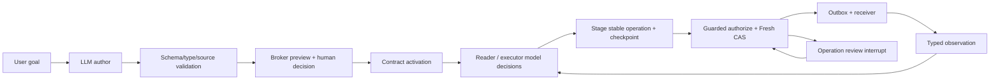

# AtomicRoot Fase 3.5

Status 5 Oktober 2026: **implemented / offline verified**. Regression aktual:
**231 passed, 7.66 s**. Baseline sebelum perubahan: **185 passed**.
OpenAI live **BELUM DIJALANKAN / BLOCKED**: `OPENAI_API_KEY` dan `OPENAI_MODEL`
tidak tersedia. JEV live **BELUM DIJALANKAN / BLOCKED**: `TYPESAFE_API_KEY` tidak
tersedia. Fase ini **belum tervalidasi live**; keberhasilan fake/replay/SDK mock
bukan bukti inference live. Tidak ada API model yang dipanggil dalam verifikasi.

## Audit dan patch kompatibilitas Fase 3

| Requirement | Evidence awal / gap | Patch dan evidence akhir | Status |
|---|---|---|---|
| CAS, signature, caller, one-use, consistent snapshot | `framework/runtime.py`, `storage.py`; regression Fase 1–3 | Jalur lama dipertahankan; semua test lama lulus | Sesuai |
| Proposal terpisah dari label efektif; false PUBLIC tidak membuka release | `classification.py`, `labels.py`, `test_phase3_classification_compat.py` | Tes adapter `test_phase35_classifier.py` juga memeriksa candidate PUBLIC, label UNKNOWN, dan restriction | Sesuai |
| Digest/content/base-label acceptance atomik | `LabelManager.accept_classification` | Dua test mengubah content/label dari koneksi lain selama inference; acceptance STALE | Sesuai |
| Label resmi diperketat setelah read menginvalidasi release task | **Gap terbukti**: regression baru menghasilkan COMMITTED untuk tiket send lama | `labels.py::_propagate_label`, `test_phase35_compat.py`; kini STALE lalu DENY | Dipatch minimum |
| Urutan pilihan, actual model, usage, coverage, configurable threshold | Metadata Fase 3 belum lengkap | Tambahan default pada typed proposal dan field result optional; tidak mengubah tabel lama | Dipatch additive |
| Gateway ingestion scope sebelum provider call | `classify_document` dan `provider_scope` sudah ada; receiver hanya simulator | Inference receiver memakai intent/outbox yang sama; test tanpa scope membuktikan nol provider call | Sesuai setelah integrasi |
| Tidak menahan transaksi saat inference | Dispatcher lama melepas transaksi sebelum dummy receiver | `inference.py`, `memo.py`; test writer koneksi terpisah selama inference | Sesuai |
| Preserve ledger/history ketika migrasi | `CREATE TABLE IF NOT EXISTS`, test migrasi Fase 3 | Tiga tabel inference ditambahkan; tidak ada reset/drop/rebuild | Sesuai |

Bug yang terbukti ditangani terpisah: perubahan resmi PUBLIC→SENSITIVE setelah
read sebelumnya tidak memperbarui `exposure:<task>`. Regression gagal sebelum
patch (`COMMITTED` vs `STALE_TICKET`), lalu lulus. Label Manager kini melakukan
monotone union exposure task yang memiliki accepted read untuk digest tersebut,
di transaksi label yang sama. Penghilangan purpose juga menambahkan UNKNOWN.
Label/restriction yang lebih permisif tidak menghapus exposure sebelumnya.
Read intent yang belum/ gagal delivered dapat menerima pembatasan konservatif.

## Requirement integrasi → evidence

| Requirement | Implementasi / test | Status |
|---|---|---|
| Satu framework, dua worker mengambil keputusan dari observations | `workflow.py`, `prompts.py`; `test_same_graph_model_loop_and_initial_broker_approval` | Offline verified |
| Satu adapter generatif, fake/replay/live melalui graph yang sama | `providers.py`, `ModelBridge`; SDK asli lewat mock transport di `test_phase35_sdk.py` | Offline verified; live blocked |
| Authoring grammar/fact/tool schema, bounded repair, unsupported tetap terlihat | `author_messages`, `_proposal`, `_preview`; bounded invalid authoring dan model-authored DSL enforcement tests | Offline verified |
| Initial preview/activation dan contract revision memakai Broker | `contract_review` node, CLI; budget increase test memeriksa review dan stale ticket | Offline verified |
| Satu guarded worker tool, tolak protected fields dan unguarded registration | `guarded.py`; tujuh protected-field cases dan registry/admin test | Offline verified |
| ALLOW/CAS, DENY/no effect, bounded STALE reauth, ESCALATE trusted consent | `GuardedTools.execute`; stale/replay/UNKNOWN tests di `test_phase35_guarded.py` | Offline verified |
| Durable staged op sebelum effect; restart tidak menggandakan budget | `SqliteSaver`, stage/effect nodes; test restart dengan runtime/koneksi baru | Offline verified |
| Resume/model text bukan approval, stale grant butuh review baru | Contract/operation interrupts; forged approval, reject, stale approved review tests | Offline verified |
| Model inference juga data egress | `model_inference`, `egress.py`, source/exposure/provider checks di snapshot Authority | Offline verified |
| Disabled/fake/replay/jev, tanpa generative classifier fallback | `ClassificationProvider`, empat mode; replay binding dan SDK tests | Offline verified |
| JEV Choice/distribution/model/usage tervalidasi | `validate_choice`, `ClassificationProposals.record`; invalid response cases | Offline verified |
| Short full-text extraction, abstention, no OCR | `extraction.py`; email, invalid PDF, HTML/attachment, terlalu panjang tests | Offline verified |
| Cache terikat digest/version/model/criteria/scope; acceptance tidak berulang | `InferenceMemo`, bound jobs, durable receipt; classifier replay/changed binding tests | Offline verified |
| Bounded calls/retries/tokens/cost config, count ambiguous attempts | `Limits`, `inference_attempts`; retry/cap/in-flight tests | Offline verified |
| Versioned JEV tersedia pada akun sebelum live classification | CLI memanggil SDK `models.list`, dihitung sebagai attempt JEV | Belum dijalankan: key tidak ada |

## Alur dan boundary

`worker_messages` mengirim observations sebagai user data berprovenance, bukan
system/admin instruction. Reader dan executor memakai principal berbeda dan
shared task exposure. Delimiter/prompt bukan jaminan anti-injection; authority,
policy dan capability service tetap enforcement. Struktur graph deterministik;
pilihan action/proposal berasal dari provider. Fake demo secara eksplisit memakai
script yang membaca observations/counters. Mode live memanggil SDK untuk proposal
dan setiap keputusan berikutnya, tanpa mengganti respons dengan action fixture.

Tool registry worker hanya `guarded_action`. LLM mengirim `kind/tool/args`, tidak
identity, task, operation ID, grant, label, version, footprint atau write set.
Server menolak field tambahan di envelope maupun args. Node stage menyimpan
immutable request dan operation ID sebelum effect. Retry/rerun memakai ID/payload
yang sama; payload berbeda ditolak. Operation committed dibaca sebagai status,
bukan replay ticket. Ticket schema Fase 1 tetap sama.

Checkpoint SQLite terpisah dari ledger. Tidak pernah memulihkan counter atau
kontrak dari checkpoint. Broker grant adalah sumber approval; `Command(resume=True)`
tidak membuat grant. Reauthorization maksimum 2 (3 CAS attempts), dispatch maksimum
2 per wrapper invocation, repair maksimum 2, review renewal maksimum 2, worker
steps CLI maksimum 8. Operasi baru membutuhkan proposal eksplisit baru.

## Inference egress

Authoring pertama memakai izin penggunaan provider yang diberikan host melalui
`bootstrap_authorized`; CLI live meminta `--authorize-model-usage`. Prompt awal
belum otomatis diklasifikasikan/dideteksi rahasianya. Gunakan PUBLIC/synthetic
input saja. Ini asumsi boundary, bukan klaim DLP terhadap prompt user.

Sesudah aktivasi, host membekukan seluruh messages/sources/model/prompt version
sebagai resource konteks. `model_inference` melalui Authority/Gateway/outbox,
terikat digest/version, provider, purpose, contract, task exposure, dan versi
setiap source document/label. Scope konteks harus mencakup UNKNOWN default dan
semua exposure; setiap source juga membutuhkan provider rule tersendiri. Content
tidak dikirim sebelum intent COMMITTED. Payload delivery berasal dari snapshot
yang diterima, tidak membaca ulang mutable reference.

**Perubahan semantik terarah:** tool baru `model_inference` dapat memakai scope
provider yang secara eksplisit mengizinkan SENSITIVE synthetic context. Ini
izin inference tertentu; email/transfer/deploy tetap hard DENY setelah exposure
SENSITIVE. Tidak dibuka oleh approval umum. Tool `classify_document` mempertahankan
penolakan SENSITIVE Fase 3; pilot JEV memakai fixture PUBLIC/UNKNOWN yang memiliki
approved ingestion scope. Registry worker tidak mengekspos kedua host inference
methods sebagai tool administratif/model-chosen action.

Penerimaan intent adalah titik linearization; label/kontrak yang berubah setelah
commit tidak merevoke delivery secara atomik. Acceptance klasifikasi tetap
memeriksa content/base label terkini dalam transaksi tersendiri sebelum restriction.
Network/menunggu manusia tidak menahan lock/transaksi ledger. SQLite tetap satu
physical writer pada satu waktu.

## JEV dan evidence

JEV opsional dan bukan evaluator policy. Z3 tetap evaluator tunggal.
Choice order tetap **PUBLIC, SENSITIVE, UNKNOWN**. Criteria v1 menjelaskan bahwa
PUBLIC membutuhkan trusted sharing basis untuk scope; tidak menemukan PII saja
tidak cukup. State memisahkan trusted owner metadata dari untrusted document.
Respons harus menyebut actual model yang sama dengan versioned configured ID,
memuat distribusi lengkap finite 0..1 dengan jumlah `1 ± 1e-6`, dan confidence
finite 0..1. Response/model/usage invalid → CLASSIFIER_ERROR / candidate UNKNOWN.

Proposal menyimpan option order, reported model, provider mode (termasuk fake),
usage bila dilaporkan, extraction/coverage, threshold, expected model dan exact
content/base-label/criteria binding. Threshold default **0.8 provisional**, bukan
probabilitas sistem aman. UNKNOWN/low confidence/missing confidence/truncation/
error abstain. Label resmi yang valid tetap disimpan. Telemetry tidak bump conflict
keys. PUBLIC proposal tidak menerima release; explicit owner acceptance hanya
dapat menambah SENSITIVE restriction jika active contract mengizinkannya.

Cache adalah memo operasi tepat; key/binding mencakup exact immutable payload,
digest/version, model, criteria, base label dan scope. Model/criteria/version
berbeda membutuhkan operasi baru. Receiver receipt replay membawa hasil original;
query proposal status untuk status acceptance terbaru. Acceptance yang sudah
diputuskan ditolak, sehingga tidak menerapkan restriction dua kali.

SDK retry internal dimatikan. Attempts dicatat durable sebelum call, termasuk
timeout/lost response, dengan bounded host retries (default 0; maksimum 2).
Simultaneous attempt untuk call sama ditunda; abandoned call tetap UNKNOWN.
Crash setelah provider menerima request sebelum respons tersimpan dapat menagih
ulang pada retry yang diizinkan. **Tidak ada klaim exactly-once inference.**
Memo ini berbeda dari dedupe atomic dummy receiver.

## Dependency/API/migrasi

Dependency baru dipin: LangGraph **1.2.12**, SQLite checkpointer **3.1.1**,
OpenAI **3.24.0**, TypeSafe SDK **0.7.2**, pypdf **6.19.0**. API yang dipasang
diperiksa melalui signature/source lokal dan mock transport dengan SDK asli.
OpenAI memakai official async Chat Completions JSON mode dan strict service
validation; JSON mode sendiri tidak menjamin schema. Model harus dikonfigurasi.
JEV default **jev-1.13.0**; CLI live memverifikasi SDK model listing, tanpa fallback
ke `jev-latest`. Ketersediaan versioned ID pada akun belum dapat diverifikasi live.

Referensi resmi yang dibaca: [LangGraph interrupts](https://docs.langchain.com/oss/python/langgraph/interrupts),
[SQLite checkpointer](https://reference.langchain.com/python/langgraph.checkpoint.sqlite),
[TypeSafe SDK](https://docs.typesafe.ai/sdk/python),
[TypeSafe usage/model selection](https://docs.typesafe.ai/sdk/python/usage), dan
[OpenAI structured outputs/JSON mode](https://developers.openai.com/api/docs/guides/structured-outputs).

Migrasi additive ketika `InferenceMemo` dibuka: `inference_jobs`, `inference_memo`,
`inference_attempts`. Checkpoint membuat tabelnya di file terpisah. Tidak ada ALTER
yang mereset data, drop, atau migrasi ulang Fase 1–3. Active contracts/counters/
grants/tickets/outbox/history tetap. `ClassificationProposal` menambah default;
record lama tetap dapat dibaca. Result API menambah field optional; endpoint lama
tetap. `Dispatcher.claim` menambah selector task/operation internal. Tool registry
menambah `model_inference`; kontrak lama tidak mendapat capability otomatis.

File inti yang berubah: `framework/{classification,labels,outbox,registry,dsl,runtime,schema}.py`.
File baru integrasi: `integration/{providers,memo,egress,guarded,inference,prompts,workflow,extraction,pilot}.py`.
CLI: `phase35_cli.py`. Konfigurasi: `pyproject.toml`, `.env.example`, `.gitignore`.
Evidence: lima `test_phase35_*.py`, network-blocking `tests/conftest.py`,
`examples/phase35`, dan `PHASE35_RESULTS.json`. Dokumen fase lama dipertahankan.

## Hasil aktual dan batas klaim

- Baseline: 185 tests lulus. Final: **231 tests lulus** (46 tambahan).
- Lima CLI demo offline selesai: literature (dua read + dummy send), injection
  (recipient di luar scope DENY), sensitive (read lalu release DENY), budget
  (dua 400, reviewed cap 500→1000), UNKNOWN (operation consent terpisah).
- CLI fault setelah committed effect, sebelum node checkpoint, kemudian recovery:
  **DONE, spent 800, tepat 2 dummy payments**. Test restart juga membuka runtime
  dengan koneksi database baru.
- Live configuration checks dijalankan terpisah: OpenAI BLOCKED dan JEV BLOCKED;
  tidak ada real token usage atau biaya yang dapat dilaporkan.
- Pengujian injection memakai malicious fixture independen dari kemampuan model.
  Tidak membuktikan semua prompt injection tertangkal atau policy sesuai maksud
  user. Validasi bentuk/encoding dan freshness berbeda dari kebenaran fakta/model.

Trust boundary prototipe adalah konfigurasi tools dan host services; belum ada
sandbox terhadap arbitrary malicious Python/host process. Local CLI approver dan
storage owner adalah principal host/fixture, bukan deployment authentication.
Directory `.runs` berisi signing seed/checkpoints/transcripts; simpan privat dan
diabaikan Git. Windows ACL harus dikelola host saat dipakai di luar pilot.
Tidak ada real email/payment/deploy, scheduler adversarial lengkap, atau benchmark
penuh. Berhenti di Fase 3.5.
