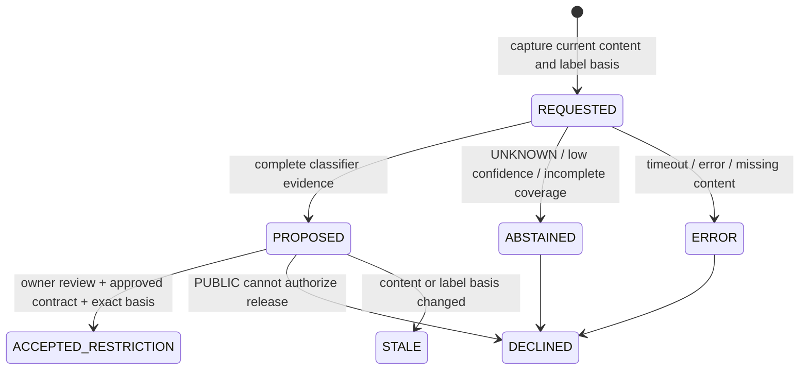

# Audit kompatibilitas / patch kondisional Fase 3 — 5 Oktober 2026

## Status dan batas tugas

Audit membaca AGENTS.md, README, PHASE3.md, registry, API, DSL, Label Manager,
Contract Service, schema generator/artifact, pembentukan tabel SQLite, dan test.
Tidak ditemukan migrator terpisah atau database bisnis persisten di workspace.
Baseline aktual: **149 passed**. Status B/D/F di bawah adalah kebutuhan baru,
bukan diagnosis bug terhadap lingkup Fase 3 sebelumnya.

Patch memakai mekanisme label, snapshot, CAS, Z3, identitas, approval kontrak,
Gateway, dan outbox yang sudah ada. Tidak ada SDK provider/model, JEV live,
training, framework agent, dependency baru, atau perubahan evaluator.

## Matriks requirement → evidence → status

| Requirement | Bukti sebelum patch | Status awal | Patch / test evidence | Status akhir |
|---|---|---|---|---|
| A audit implementasi/regression | AGENTS.md, PHASE3.md, framework/*, tests/* | sesuai fondasi | audit ini + baseline 149 | diverifikasi |
| B label resmi owner/metadata/rule ingestion | labels.StorageService.ingest / LabelManager.set_label; phase3_labels_approval | sesuai; classifier storage belum ada | classification.ClassificationProposal + begin/record/status; cached binding tests | penyimpanan proposal ditambahkan |
| C proposal terpisah, tanpa PUBLIC promotion | label updater role owner dan API tanpa set_fact | sesuai; acceptance classifier belum dimodelkan | labels.accept_classification; public_proposal_cannot_release_or_downgrade, worker/classifier rejection | restriction-only acceptance |
| D exact content/label-basis atomic acceptance | SQLite transaction/label key sudah ada | gap kebutuhan baru | begin captures base version/hash/snapshot; accept verifies exact digest/version/basis; stale/concurrent/rollback tests | sesuai, offline verified |
| D policy invalidation vs confidence telemetry | existing label/exposure dependency | perlu enforcement update baru | label/exposure bump satu transaksi; pending read/release stale; abstention does_not_invalidate test | sesuai |
| E UNKNOWN/error tidak PUBLIC, valid label dipertahankan | UNKNOWN default / sensitive hard DENY | sesuai jalur lama | result coercion to UNKNOWN on failure/abstention; failure_keeps_valid_label; generic consent cannot override | sesuai |
| F provider/resource/purpose/type sebelum egress | ordinary scope + immutable resource payload; belum ada inference tool/provider path | gap kebutuhan baru | classify_document, provider_scope Z3, optional inference_egress contract; Spy receiver no calls without scope | enforcement simulasi tersedia |
| G additive migration preserving records | FrameworkStore CREATE IF NOT EXISTS | sesuai pola | satu tabel baru; row-for-row migration test + old grant/ticket Commit succeeds | sesuai |

Seluruh 149 test lama dipertahankan. Test baru berada di
`atomicroot/tests/test_phase3_classification_compat.py`. Gap baru tidak diperlakukan
sebagai kerusakan Phase 3 yang sudah selesai.

## Proposal, acceptance, dan label efektif

`ClassificationProposal` menyimpan proposal_id, resource identity, digest,
content_version, base_label_version/hash dan snapshot label yang direview,
model ID/version, criteria_version/hash, created_at/evaluated_at, submitter,
candidate/reported candidate, probabilities/confidence bila ada, input_bytes,
covered_bytes, truncated, status/reason, serta accepted restriction bila ada.

Alur ringan:



Begin/result/status adalah intake evidence, bukan API untuk mengambil isi
dokumen atau melakukan inference. Role classifier hanya dapat membuat/menyimpan
evidence dalam authenticated resource scope. Result harus mengulang binding
content/model/criteria yang sama; cached response dengan binding lain ditolak.
Owner dalam task/resource scope melakukan acceptance melalui Label Manager.

Acceptance yang ditambahkan hanya **restriction SENSITIVE**. Kontrak aktif harus
memiliki `classification_restrictions: true` yang telah melalui preview/approval/
activation biasa. PUBLIC/UNKNOWN/error/abstention tidak mengubah label resmi.
Penetapan label resmi tetap melalui operasi owner yang sudah ada, secara terpisah
dari proposal classifier. Tidak ada tombol approval umum yang membuka hard DENY.

Restriction tersimpan di metadata `label:<resource>.restrictions`, terpisah dari
field label/source/label_set_by resmi. Label Manager menggabungkannya saat
resolve effective label. Penetapan ulang label resmi pada versi yang sama
mempertahankan restriction. Ingest versi baru menginisialisasi label UNKNOWN
seperti sebelumnya; restriction versi lama tidak dibawa ke konten baru.

Acceptance menjalankan satu BEGIN IMMEDIATE: cek digest/content version + exact
base-label version/hash → append restriction → bump existing label key →
monotone SENSITIVE exposure untuk task dengan recorded read resource/digest →
save accepted proposal → append service event. Kegagalan rollback seluruhnya.
Tidak ada key baru yang menggantikan dependency lama.

Propagasi exposure membuat pending release ticket/grant task terkait stale,
meskipun read awalnya PUBLIC. Karena trace lama tidak menyimpan scope/version
label per read secara lengkap, pencocokan resource/digest bersifat konservatif:
task yang pernah membaca bytes sama dapat ikut dibatasi. Ini over-approximation
yang dinyatakan, bukan tracking information flow sempurna. Exposure tidak
dibersihkan oleh proposal PUBLIC, classifier error, label reaffirmation, atau
resume. Intent yang sudah COMMITTED mengikuti batas linearization outbox lama.

Proposal dan confidence adalah telemetry di tabel terpisah, tidak masuk
Footprint. Hanya accepted effective update yang menaikkan label/exposure key.
Probabilities diperiksa finite [0,1] dan sum=1; confidence finite [0,1].
Threshold abstention 0.8 bersifat provisional, belum dikalibrasi. Truncation,
coverage tidak penuh, UNKNOWN, TIMEOUT, ERROR, MISSING_CONTENT → kandidat UNKNOWN.
Label resmi valid tetap dipertahankan. Confidence tinggi tidak pernah menjadi
bukti PUBLIC atau izin egress.

## Boundary provider inference

Tidak ada provider API live pada kode sebelumnya. Patch menambahkan satu
**tool simulasi** `classify_document` melalui Authority → IntentGateway →
outbox → receiver offline yang sama. Argumen konkret:

```json
{"resource": "paper", "digest": "sha256:<actual-content-hash>", "to": "offline-provider"}
```

Kontrak harus mengizinkan tool, resource, recipient/provider, agent, purpose,
dan aturan ingestion `inference_egress`. Tiap aturan mengikat provider identity,
resource identity, purpose, dan label efektif yang boleh dikirim. Maksimum
16 aturan. Default resmi untuk kontrak lama: [] = tidak ada inference egress.

```json
{
  "classification_restrictions": true,
  "inference_egress": [
    {
      "provider": "offline-provider",
      "resource": "paper",
      "purpose": "research",
      "labels": ["PUBLIC", "UNKNOWN"]
    }
  ]
}
```

Seluruh constraint lama tetap berlaku. UNKNOWN ingestion ke provider dapat
diizinkan hanya oleh aturan ingestion terpisah yang sudah disahkan; parameter
unknown_release untuk sharing umum tidak memberikan scope provider. Candidate
PUBLIC yang baru akan diprediksi tidak pernah dibaca evaluator. SENSITIVE tetap
hard DENY meskipun daftar ingestion menyebut SENSITIVE atau ada grant umum.

Constraint provider memakai AST/Z3 yang sama. Nilai parameter dibaca melalui
StatusReader dari contract snapshot; resource/digest/label dibaca pada snapshot
yang sama. Footprint tetap memakai contract3, document, label, exposure dan key
lama lain. Perubahan kontrak/resource/label sebelum Commit membuat tiket stale.
Payload konten yang dibekukan tetap privat dan hanya tersedia pada trusted
outbox receiver setelah Commit. Tidak ada inference call dalam transaksi atau
jalur baru di luar Gateway.

Receiver saat ini hanya mencatat `OFFLINE_SIMULATION` / UNKNOWN dan receipt pada
state simulasi. Tidak memanggil HTTP/model/provider nyata. Test Spy receiver
membuktikan tidak ada adapter call atau dispatchable outbox tanpa scope. Live
provider authorization dan actual network behavior: **NOT RUN**; integrasi live
berada di luar tugas ini. Provider endpoint/credential registry harus disediakan
host tepercaya saat integrasi berikutnya, bukan berasal dari worker.

## API dan schema yang berubah

| API | Principal / tujuan |
|---|---|
| POST /classification/proposals | classifier dalam resource scope; capture exact basis |
| POST /classification/proposals/{id}/result | classifier/submitter yang sama; evidence bound |
| GET /classification/proposals/{id} | owner/classifier dalam resource scope; metadata, bukan konten |
| POST /classification/proposals/{id}/accept | owner dalam task + resource scope; body task_id/purpose |
| /authorize → /commit → /dispatch | existing worker/dispatcher identity separation untuk classify_document |

Acceptance STALE mengembalikan HTTP 409. Unauthorized updater 403, invalid data
422. API tidak menerima claimed role/updater atau generic set_fact.

`/schema` dan `examples/phase3/schema.json` ditambah definitions
classification_begin/result/accept, dua field kontrak optional, dan tool baru.
Field required kontrak lama tidak berubah. Schema tetap dilengkapi validasi
semantic/type/coverage/binding pada service. Contoh baru:
classification-begin.json, classification-result.json (truncated → abstention),
inference-contract.json. Resource digest harus sesuai storage aktual; contoh
tidak mengaktifkan data atau inference secara otomatis.

## Migrasi dan daftar perubahan Fase 3

Migrasi additive pada pembukaan FrameworkStore:

```sql
CREATE TABLE IF NOT EXISTS classification_proposals (
    id TEXT PRIMARY KEY,
    resource TEXT NOT NULL,
    status TEXT NOT NULL,
    data TEXT NOT NULL
);
```

Tidak ada ALTER/drop/reset/backfill kontrak, ledger, grants, authorizations,
outbox, receipt, atau trace. Test membuat database dengan schema lama dan
memastikan setiap row bisnis persis sama setelah reopen, lalu memakai tiket/
grant lama dengan sukses. Telemetry classifier hanya memakai tabel baru dan
service_events yang sudah ada. Tidak ada database bisnis workspace yang
dimigrasikan dalam sesi ini.

Registry tetap kode host immutable. Perubahan transition/updater label dan
exposure menunjuk operasi Label Manager resmi yang baru; tidak ada endpoint
worker untuk mengedit registry. Dua parameter optional kontrak hanya berubah
melalui approved Contract Service revision.

| File | Perubahan minimum |
|---|---|
| framework/classification.py | typed proposal + evidence intake/status/abstention |
| framework/storage.py | satu tabel additive |
| framework/labels.py | exact acceptance, preserve authority/restriction, effective resolve/exposure propagation |
| framework/contracts.py | dua field optional dengan validasi/diff/approval existing |
| framework/registry.py | classify_document simulator; official Label Manager transitions |
| framework/runtime.py | trusted contract inference parameters pada snapshot yang sama |
| framework/dsl.py | provider_scope Z3, separate authorized UNKNOWN ingestion |
| framework/outbox.py | offline simulator branch pada receiver existing |
| framework/app.py | empat API evidence/acceptance + composition |
| framework/schema.py + examples schema | schema additive |
| tests/test_phase3_classification_compat.py | 36 offline compatibility tests |
| examples/phase3/*.json | tiga contoh baru |
| README.md, PHASE3.md, audit ini | perubahan kondisional dan batas klaim |

Tidak ada refactor evaluator/store/outbox inti atau pengulangan Fase 3.

## Hasil verifikasi aktual

- Baseline: `python -m pytest atomicroot/tests -q` → **149 passed**.
- Test terarah: `python -m pytest atomicroot/tests/test_phase3_classification_compat.py -q` → **36 passed**.
- Regression setelah patch: **185 passed**; warning deprecation Starlette/httpx yang sudah ada.
- `python -m compileall -q atomicroot phase3_cli.py` → exit 0.
- `python phase3_cli.py demo` → exit 0; workflow Fase 3 lama tetap berjalan.
- Schema artifact cocok dengan generator; contoh kontrak lama/baru, policy,
  dan proposal/result klasifikasi berhasil diperiksa oleh validator service.
- Real model/JEV/provider network calls: **NOT RUN**, sesuai lingkup audit/patch offline.

Test membuktikan mekanisme binding, freshness, authority separation, rollback,
migration dan blocked dispatch pada fixture yang didukung. Tidak membuktikan
akurasi classifier, universal security, atau exactly-once provider.
